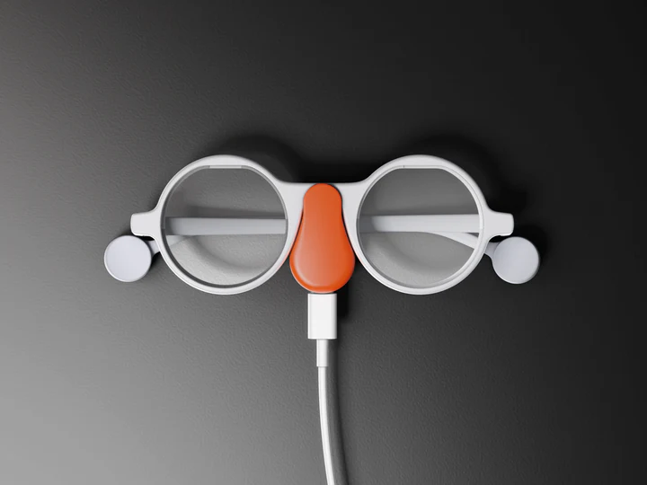
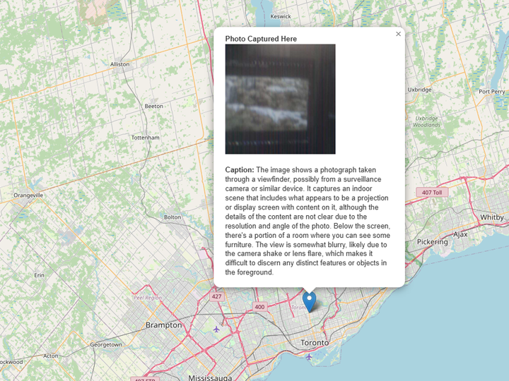

# ◉–◉ FrameMap: Photo Capture, Description, and Location Visualization  
Seamlessly capture images, generate descriptions using the LLaVA model, and visualize them on an interactive map with spatial context.

---

## 📝 Overview  
**FrameMap** integrates Brilliant Labs Frame smart glasses with the LLaVA Vision-Language model to:  

1. **Capture Photos** using the Frame.  
2. **Generate Descriptions** of photos with the LLaVA AI model via Ollama.  
3. **Extract Location** (latitude and longitude) where the photo was captured.  
4. **Visualize Captured Photos** on an interactive map (OpenStreetMap). Clicking the photo marker reveals its caption.  

This project is perfect for developers experimenting with AR hardware, AI-powered vision, and interactive geospatial technologies.

---



---



---

## ✨ Features  

- **📷 Smart Image Capture**: Captures high-quality photos using Brilliant Labs Frame.  
- **🌍 Location Extraction**: Detects photo location (latitude, longitude) via IP-based services.  
- **🤖 AI-Powered Descriptions**: Describes photo content using the LLaVA model running locally via Ollama.  
- **🗺️ Interactive Map**: Displays photo markers on a web-based OpenStreetMap. Clicking a marker reveals the photo and its caption.  
- **📄 Persistent Storage**: Saves image metadata (location, caption, and path) to `photo_metadata.json` for frontend visualization.  

---

## 🚀 Getting Started  

### Prerequisites  
**Hardware**:  
- Brilliant Labs Frame  

**Software**:  
- Python 3.7+  
- Frame SDK  
- LLaVA model (via Ollama)  
- Web Browser (for frontend map visualization)  

---

### Step 1: Install Ollama  

Ollama is a tool to run models like LLaVA locally.  

1. **Download and Install Ollama**:  
   Visit [Ollama's official website](https://ollama.ai/download) and follow installation instructions for your OS.  

2. **Verify Installation**:  
   ```bash
   ollama --version
   ```  

3. **Pull the LLaVA Model**:  
   ```bash
   ollama pull llava
   ```  

4. **Start the Ollama Server**:  
   Run the following command to start the LLaVA model API server locally:  
   ```bash
   ollama serve
   ```  
   Keep this terminal open while running the main script.  

---

### Step 2: Install Python Dependencies  

Clone the repository and install the required libraries:  

```bash
git clone https://github.com/yourusername/framemap.git  
cd framemap  
pip install frame-sdk requests geopy
```

---

### Step 3: Run the Backend Script  

Run the script to capture photos, generate captions, and save the metadata:  

```bash
python backend.py
```

---

### Step 4: Visualize on the Map  

1. Open the `index.html` file located in the repository.  
2. The map will display photo markers based on `photo_metadata.json` (generated by the backend).  
3. Clicking a marker reveals the photo and its AI-generated caption.  

---

## 📱 Usage  

### 1. **Connect the Frame**  
Ensure the Brilliant Labs Frame is paired with your computer via Bluetooth. The script will connect automatically.  

### 2. **Run the LLaVA Model**  
Start the LLaVA server using Ollama:  
```bash
ollama serve
```

### 3. **Capture and Generate**  
Run the Python script:  
```bash
python backend.py
```
- Captures the photo.  
- Fetches the geolocation.  
- Sends the photo to LLaVA for captioning.  
- Saves metadata to `photo_metadata.json`.  

### 4. **View Results**  
- **Photos**: Saved as `captured_photo.jpg`.  
- **Captions**: Stored in `captions.txt` and `photo_metadata.json`.  
- **Map**: Open `index.html` in a browser to visualize photos on the map.  

---

## 🛠️ Built With  

- **Brilliant Labs Frame SDK**: Captures images from the Frame hardware.  
- **LLaVA Model**: AI model for vision-language processing.  
- **Ollama**: Simplified local deployment of LLaVA.  
- **Geopy**: Retrieves human-readable addresses.  
- **IPInfo.io**: Provides geolocation data via IP.  
- **Leaflet**: Interactive OpenStreetMap display.  

---

## 🧭 Example Output  

**Terminal Output**:  
```bash
Requesting location permissions...  
Using IP-based geolocation...  
Location: Latitude 37.7749, Longitude -122.4194  
Photo saved at: captured_photo.jpg  
Generated Caption: "A person hiking on a mountain trail with a scenic background."  
Metadata saved to photo_metadata.json
```  

**captions.txt**:  
```
2024-06-17 14:30:01: A person hiking on a mountain trail with a scenic background.
```  

**Map Visualization**:  
Markers appear on the map. Clicking a marker displays:  

- **Photo**  
- **Caption**  

---

## 🧭 Interactive Map  

The frontend displays:  
1. **Markers**: Representing where photos were captured.  
2. **Popups**: Clicking on a marker shows the photo and its caption.  

---

## Troubleshooting  

- **Bluetooth Issues**: Ensure the Frame is connected and paired correctly. (this is automated)  
- **LLaVA Not Running**: Confirm that Ollama is running using `ollama serve`.  
- **Location Errors**: Ensure you have an active internet connection for IP-based geolocation.  
- **Empty Map**: Verify that `photo_metadata.json` is populated after running the backend.  

---

## 📄 License  
This project is licensed under the MIT License.  

---

## 🙏 Acknowledgments  

- **Brilliant Labs** for their innovative Frame smart glasses.  
- **LLaVA Team** for the powerful vision-language model.  
- **Ollama** for making local model deployment seamless.  
- **Leaflet** for the OpenStreetMap integration.  
- **Geopy** and **IPInfo.io** for location services.  
- **OpenCage** for providing geolocation services.